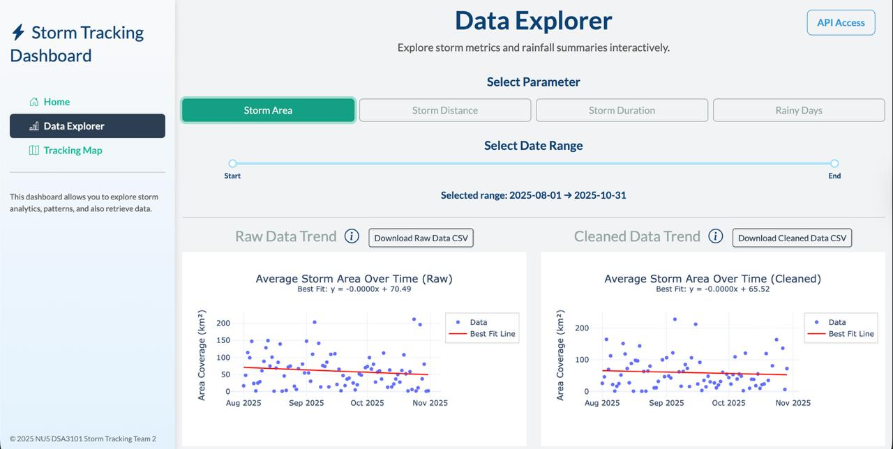
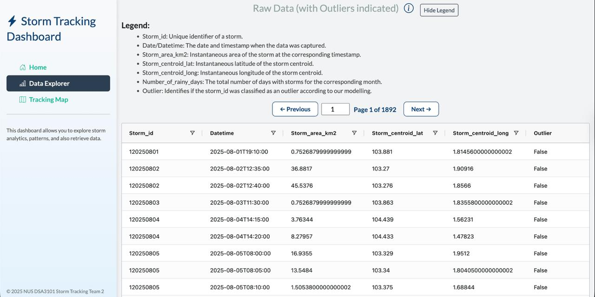
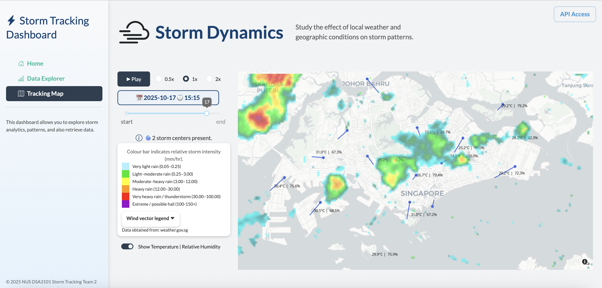

# 🌩 Storm Tracking and Analytics Platform

## Overview

This project is a storm tracking and analytics web platform built to explore large-scale meteorological data in Singapore. The platform enables:

* Interactive storm maps with overlays for wind, temperature, and humidity

* Queryable storm event tables (~36,000 rows) with pagination and caching

* Analysis of historical storm frequency and intensity trends

* Full end-to-end deployment using Docker Compose

The platform integrates a Dash-based frontend with a cloud-hosted SQL database through an SQLAlchemy abstraction layer.

Repository Structure
```
storm-tracking-dashboard-project-dsa3101/
│
├── storm_project/          # Full runnable team project
│   ├── app/
│   ├── src/
│   ├── docker-compose.yml
│   └── ...
│
├── my_contributions/       # My personal work for reference
│   ├── sql/                # SQL scripts I wrote
│   ├── frontend/           # Components I built
│   └── README.md           # Explanation of contributions
│
└── README.md               # Main overview
```
## My Contributions

This was a team-based project, and my primary responsibilities included:

* Designing and implementing the frontend dashboards and interactive tables

* Building the SQL scripts to populate and structure the frontend database

* Implementing caching and pagination for performance optimisation

* Integrating frontend services into Docker Compose and debugging service orchestration

* Contributing to data visualisations including storm maps, wind vectors, temperature, and humidity overlays

All files and code I specifically worked on are available in the `my_contributions` folder.

## Key Technical Highlights

Performance: Optimised interactive tables to handle ~36,000 rows smoothly

Data Pipeline: Built a data abstraction layer using SQLAlchemy to manage queries between the frontend cache and cloud-hosted SQL databases

Deployment: Integrated and debugged Docker Compose services for full end-to-end deployment

Visualisation: Created interactive visualisations for meteorological variables

## Screenshots







## How to Run (Full Project)

Clone the repository:
```
git clone https://github.com/robinlogic/storm-tracking-dashboard-project-dsa3101.git
cd storm_project
```

Build and start services with Docker Compose:
```
docker-compose up --build
```

Access the frontend at `http://localhost:8050` (default Dash port)

Note: Full dataset and backend database setup are included in the `storm_project` folder.

## References

Dash AG Grid: [https://dash.plotly.com/dash-ag-grid]

SQLAlchemy: [https://www.sqlalchemy.org/]
